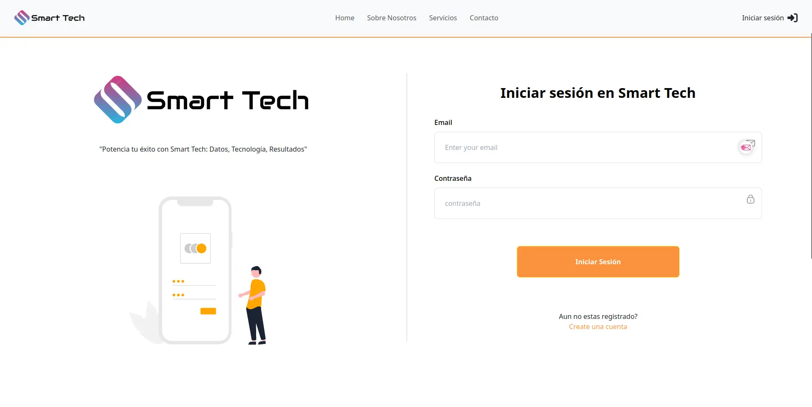
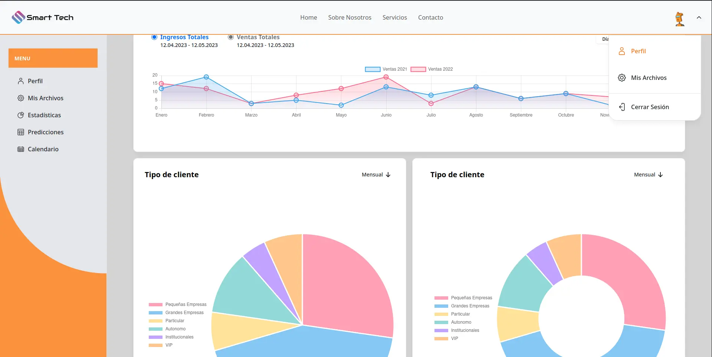
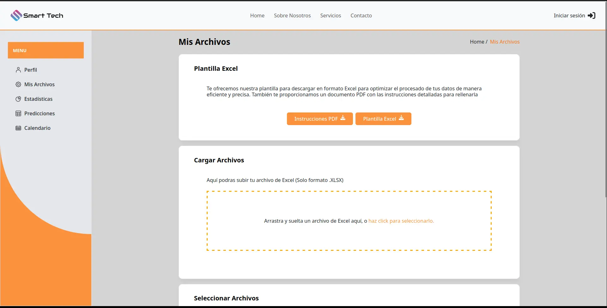

# Smart Tech:

## Datos, Tecnología, Resultados

Smart Tech IA de Marketing, es un proyecto de aplicación web para maximizar el
impacto publicitario eficiente y responsable.

## Tabla de Contenidos

- [Descripción](#descripción)
- [Tecnologías Frontend](#tecnologías-frontend)
- [Tecnologías Backend](#tecnologías-backend)
- [Tecnologías Data](#tecnologías-data)
- [Instalación](#instalación)
- [Uso](#uso)
- [Contribución](#contribución)

## Descripción

Smart Tech IA de Marketing se centra en optimizar la publicidad de manera inteligente. Este proyecto tiene como objetivo proporcionar una plataforma eficaz y ética para maximizar la visibilidad de las campañas publicitarias.

## Tecnologías Frontend

El frontend del proyecto ha sido desarrollado utilizando las siguientes tecnologías:

- HTML5
- CSS
- JavaScript
- Bootstrap
- Tailwind CSS
- React
- Vite
- Charts JS
- Dropzone JS

## Tecnologías Backend

El backend del proyecto ha sido desarrollado utilizando las siguientes tecnologías:

- Node.js
- Express.js
- MySQL
- JWT (JSON Web Tokens)
- Bcrypt
- Cors
- Multer

## Tecnologías Data

Para el manejo y análisis de datos, el proyecto utiliza las siguientes tecnologías:

- Python
- Jupyter Notebook
- Plotly
- Matplotlib
- Pandas
- NumPy
- TensorFlow
- Scikit-Learn
- K-means

## Instalación

1. Clona el repositorio: `git clone https://url-del-repositorio.git`
2. Instala las dependencias del frontend: `cd frontend && npm install`
3. Instala las dependencias del backend: `cd backend && npm install`
4. Configura la base de datos MySQL con los parámetros adecuados.
5. Realiza cualquier otra configuración necesaria.

## Uso

Para comenzar a utilizar Smart Tech IA de Marketing, sigue estos pasos:

1. Accede a la aplicación a través del enlace proporcionado después de la instalación.
2. Inicia sesión o crea una cuenta para aprovechar al máximo las funcionalidades de la plataforma.
3. Una vez dentro, la aplicación te guiará para proporcionar la información necesaria. Se te pedirá que subas un archivo Excel con los datos de ventas de los dos últimos años en un formato de tabla que te proporcionaremos. Este archivo es esencial para que la IA realice análisis y predicciones precisas.
4. Después de proporcionar la información requerida, la aplicación utilizará inteligencia artificial para analizar los datos históricos y prever las ventas para el próximo año. Además, se generarán gráficos pertinentes para una comprensión visual más clara.
5. Con los resultados obtenidos, estarás listo para implementar campañas de marketing más eficientes, basadas en las proyecciones precisas de la IA.

## Contribución

Si deseas contribuir al proyecto, sigue estos pasos:

1. Haz un fork del repositorio.
2. Crea una nueva rama con tu función o corrección: `git checkout -b mi-nueva-funcion`
3. Realiza tus cambios y commitea los cambios: `git commit -m 'Agregar nueva función'`
4. Empuja la rama a tu fork: `git push origin mi-nueva-funcion`
5. Abre un Pull Request en el repositorio original.
